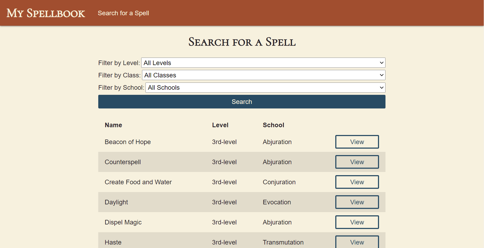

# My Spellbook

This is a CRUD web application that helps tabletop RPG players look up and keep track of spells for a game that cannot be mentioned by name due to copyright reasons.

- Non-registered users can search for spells available in the System Reference Document 5.1
  - Filter by Level, Class, and/or School
  - View expanded details of individual spells
- Registered users authorized to save spells to their own persistent collection
  - Save a search result to collection
  - Edit and delete spells already in collection
  - Create custom spells

## Live Demo

[Try out the live demo of the project.](https://my-spellbook.herokuapp.com/)

## Built With

  - [Open5e](https://open5e.com/) - Spell data
  - HTML - Project structure
  - [Sass](https://sass-lang.com/) - Project presentation
  - JS - DOM manipulation on spell index page
  - [Mongoose](https://mongoosejs.com/) - Spell and User validation, saving user data to MongoDB database
  - [Passport.js](http://www.passportjs.org/) - User authentication with passport-local strategy
  - [bcrypt](https://github.com/dcodeIO/bcrypt.js#readme) - Password hashing and salt generation